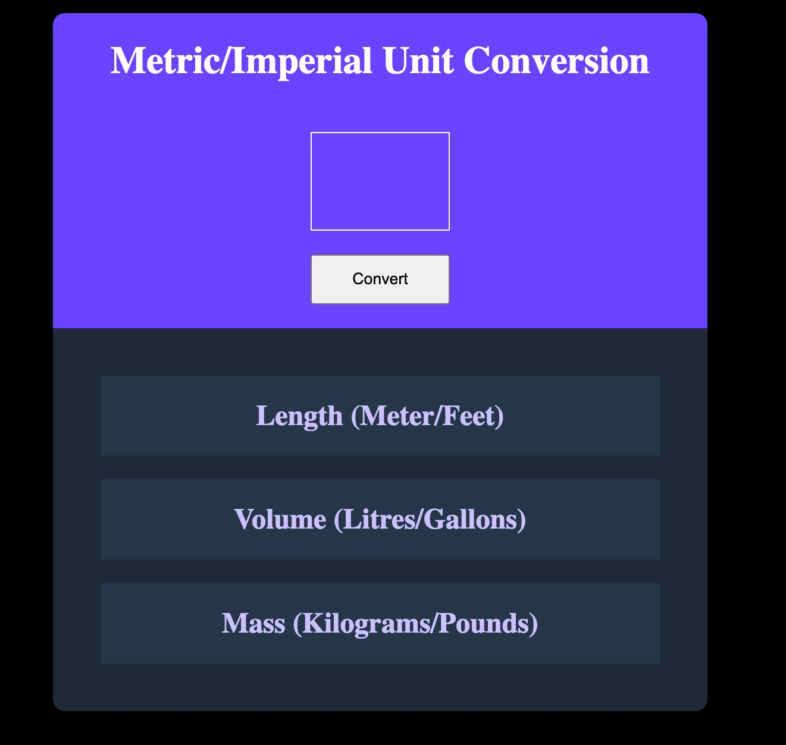

# Metric/Imperial Unit Conversion App

## Screenshots

## Live project
- https://buildinrythm.github.io/unit-converter/

## Overview
This is a small web application that converts user input between **metric and imperial units**. Users can input a number, press the convert button, and see their value converted across three categories:

- **Length**: meters ↔ feet  
- **Volume**: litres ↔ gallons  
- **Mass**: kilograms ↔ pounds  

The app dynamically updates the results, handles singular vs plural units, and is styled with a clean card layout.  

## Features
- Real-time unit conversion with a single input.  
- Proper handling of singular/plural units (e.g., `1 meter` vs `2 meters`).  
- Clear, visually distinct cards for each unit type.  
- Responsive design (mobile-friendly with media queries).  
- Easy-to-read formatting with `toFixed(2)` for decimal precision.  

## Tech Stack
- **HTML5**: structure of the app  
- **CSS3**: styling, flexbox layout, color scheme, mobile breakpoint  
- **JavaScript (vanilla)**: DOM manipulation, conversion logic, event handling  

## Usage
1. Open `index.html` in a browser.  
2. Enter a number in the input field.  
3. Click the **Convert** button.  
4. View the converted values in the Length, Volume, and Mass cards.  

## Conversion Factors Used
| Unit | Conversion |
|------|------------|
| Meter ↔ Feet | 1 m = 3.281 ft, 1 ft = 0.3048 m |
| Litre ↔ Gallon | 1 l = 0.264 gal, 1 gal = 3.785 l |
| Kilogram ↔ Pound | 1 kg = 2.205 lb, 1 lb = 0.454 kg |

## Learning Takeaways
- Practiced **DOM manipulation** and reading input values.  
- Learned to **separate logic from UI** by creating functions for each conversion.  
- Implemented **conditional logic** for singular vs plural units.  
- Explored **responsive design** with CSS media queries for mobile.  
- Learned how to **dynamically insert HTML** without overriding static content.  

## Future Improvements
- Add **input validation** to handle non-numeric entries gracefully.  
- Refactor repeated code using a **helper function** or **conversion map**.  
- Add **placeholder text** or dynamic hints in result boxes.  
- Extend the app to support more units (e.g., temperature, speed).  

## How to Run
Simply open `index.html` in any modern web browser. No build tools or frameworks required.
